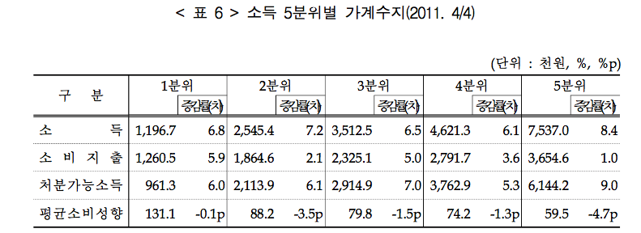

```{r setup, include=FALSE}
knitr::opts_chunk$set(echo = TRUE)
```

```{r, packages}
library(knitr)
```

## Data

자료 출처는 통계청 보도자료. 



```{r, Data}
load("./hh_econ.RData")
rownames(hh.econ.11.2) <- c("Income", "Consumer.Spending", "Disp.Income")
colnames(hh.econ.11.2) <- paste(c("Bottom", "Second", "Third", "Fourth", "Top"), "Fifth")
kable(format(hh.econ.11.2, digits = 1, nsmall = 2, big.mark = ","), align = "r")
```

## ggplots

### Data Reshaping

```{r, reshape2}
library(reshape2)
dimnames(hh.econ.11.2) <- list("Income.Expense" = rownames(hh.econ.11.2), "Income.Fifth" = colnames(hh.econ.11.2))
kable(format(hh.econ.melt <- melt(hh.econ.11.2, value.name = "Amount"), digits = 1, nsmall = 2, big.mark = ","), align = c("l", "l", "r"))
```

### ggplots step by step

```{r, ggplot, fig.width = 8, fig.height = 4.5}
library(ggplot2)
# source("./theme_kr_HCR.R")
ls()
(g1 <- ggplot(hh.econ.melt, aes(x = Income.Fifth, y = Amount, fill = Income.Expense)) + geom_bar(stat = "identity"))
(g1 <- ggplot(hh.econ.melt, aes(x = Income.Fifth, y = Amount, fill = Income.Expense)) + geom_bar(stat = "identity", position = "dodge"))
(g2 <- g1 + theme_bw())
# (g3 <- g2 + theme.kr)
(g4 <- g2 + scale_y_continuous(breaks = seq(0, 7000, by = 1000), labels = 0:7) + xlab("Income Fifth") + ylab("Amount in Million Won") + ggtitle("Household Income and Expenditure (2011)"))
(g5 <- g4 + theme(legend.position = c(0.2, 0.8)))
(g6 <- g5 + scale_fill_grey(start = 1/6, end = 5/6))
(g7 <- g5 + scale_fill_manual(values = c("blue", "cyan", "red")))
```